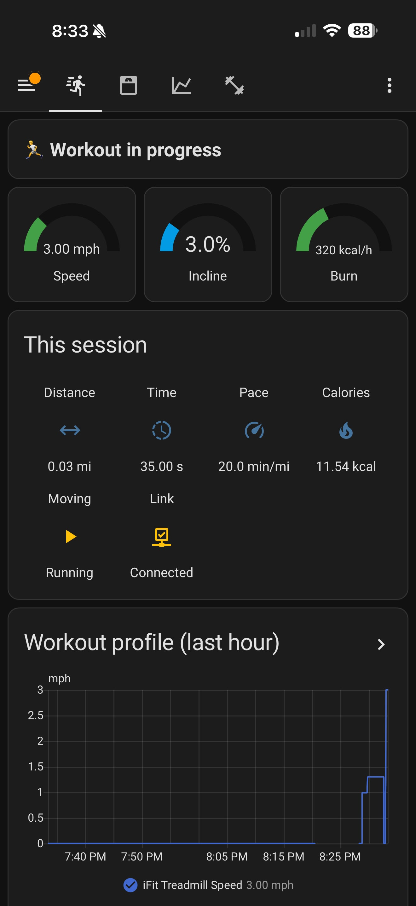
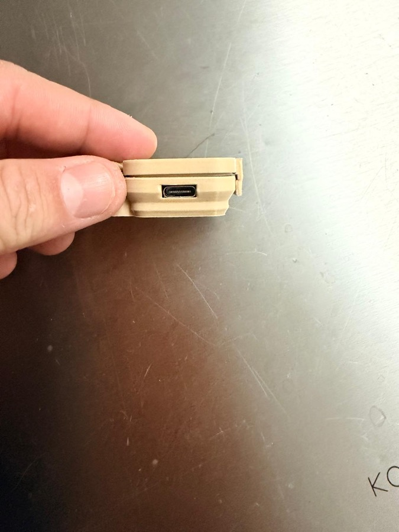

# nordictrack_t5 — ESP32-S3 iFit Treadmill → MQTT bridge

Firmware + enclosure + Home Assistant integration for the older proprietary-BLE
**NordicTrack / iFit treadmill** (advertises as `I_TL`, service
`00001533-1412-efde-1523-785feabcd123` — *not* FTMS).

An ESP32-S3 acts as a BLE central, replays the iFit polling protocol, decodes live
telemetry, and publishes it to MQTT with **Home Assistant auto-discovery** — plus
weight-aware calories and a Fitness dashboard. Set-and-forget: powered, it stays
connected and streams with zero interaction.

<p align="center">
  
  
</p>

## What it does
- BLE central → `I_TL`: handshake + **200 ms poll loop** (host-polled protocol — nothing is pushed).
- Decodes page `0x29`: **speed** (LE bytes 10–11 ÷100 km/h), **incline** (LE 12–13 ÷100 %), elapsed seconds. Verified live against the console (3 mph→482, 5 mph→804, 6 %→300).
- Publishes MQTT + HA discovery: speed, incline, elapsed, distance, moving, connectivity.
- **Weight-aware calories** (ACSM model) using your real scale weight — see `homeassistant/`.
- Dual provisioning (SoftAP captive portal **and** BLE GATT), NVS-stored creds, **MQTT-triggered OTA**, mDNS `esp_treadmill`.

## Hardware
- Generic **ESP32-S3** (SuperMini), ≥4 MB flash. Power from an always-on USB (not the treadmill).
- Printable enclosure in [`enclosure/`](enclosure/) (OpenSCAD + STLs, flush USB-C).

## Build & flash (esp-idf v5.3.4)
```bash
. $IDF_PATH/export.sh
idf.py set-target esp32s3
idf.py -p /dev/ttyACM0 flash monitor
```
First boot → no creds → SoftAP `Treadmill-Setup` + BLE provisioning → enter WiFi + MQTT
(host/port/user/pass) → it reboots into RUN mode, connects to the belt, and HA
auto-discovers the **iFit Treadmill** device.

### S3 SuperMini notes (important)
- `CONFIG_BT_BTC_TASK_STACK_SIZE=8192` (default 3072 panics on S3 during GATT discovery).
- `CONFIG_SW_COEXIST_ENABLE=y`; WiFi power-save disabled at runtime for stable BLE coexistence.
- `CONFIG_TX_POWER_QDBM` (default 34 ≈ 8.5 dBm) — the PCB antenna overdrives at max power; tune on the bench.

## Layout
| Path | What |
|------|------|
| `main/` | esp-idf firmware (Bluedroid GATTC + WiFi + MQTT + OTA + provisioning) |
| `enclosure/` | OpenSCAD rugged-box (single S3 board, flush USB-C) + STLs |
| `homeassistant/` | Fitness dashboard + weight-aware calorie templates |
| `docs/` | `TREADMILL_PROTOCOL.md` (verified decode) + `SDD-001..005` design specs |
| `tools/treadmill_poll.py` | Python (bleak) reference reader used to RE & validate the protocol |

## Credits
Protocol reverse-engineered with help from
[taylorbowland.com](https://taylorbowland.com) and
[qdomyos-zwift](https://github.com/cagnulein/qdomyos-zwift) (`nordictrack10` family).
Companion protocol repo: `nordictrack-t5-ble-protocol`.
