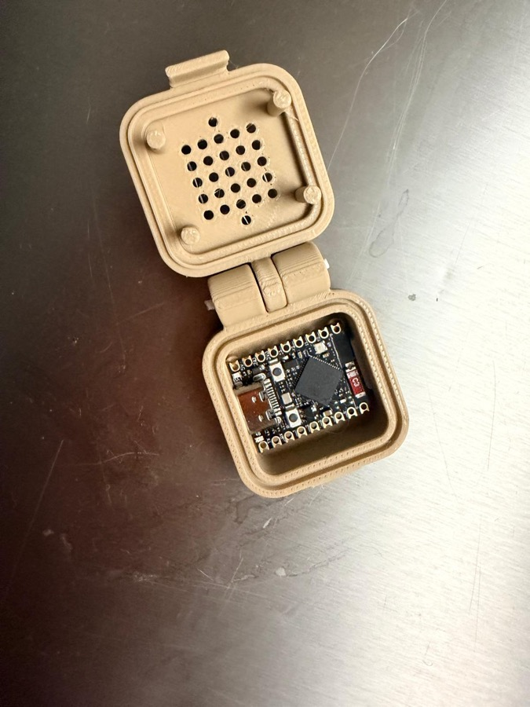

# Treadmill ESP32-S3 SuperMini Enclosure

A small printed enclosure for a single bare **ESP32-S3 SuperMini** board.
Adapted from the cpapdash Push-C3 dual-board enclosure
(`push-c3-enclosure-bareboards.scad` v1.0.9), reduced to ONE board.

<p align="center">
  
  
</p>

*Printed clamshell: filament-pin hinge + front snap-fit, lid heat-relief grill, board
seated snug on floor posts, and the USB-C cutout sized to the female receptacle so the
port sits flush at the wall.*

## Files

- `treadmill-s3-enclosure.scad` — the enclosure model.
- `rugged-box-library.scad` — smkent/monoscad rugged-box library
  (CC 4.0 BY-SA), copied unchanged. `treadmill-s3-enclosure.scad`
  `include`s it.

## What changed vs the C3 dual-board source

- **One board instead of two**: a single floor-post set (4 posts), a
  single lid-post set (4 posts), a single USB-C cutout, and a single back
  constraint rib.
- **Resized for the S3 SuperMini**, which is slightly LONGER on its long
  axis than the C3. The board long axis is parameterized as `board_w_x`
  (default 25 mm vs the C3's 22.5 mm); the box `Width` is auto-derived.
- **Kept**: the v1.0.8 plug-body USB-C cutout (12.5 x 6.8 mm), the back
  constraint ribs, the printed-pin hinge, the front snap-fit clip, and the
  lid heat-relief grill (oval hole pattern).

## Key parameters (`treadmill-s3-enclosure.scad`)

| Parameter | Default | Meaning |
|-----------|---------|---------|
| `board_w_x` | `25` | Board LONG axis in X (with USB-C end). **Measure your S3 and adjust.** |
| `board_l_y` | `18` | Board SHORT axis in Y (board width). |
| `pcb_thickness` | `1.6` | PCB thickness. |
| `Width` | `board_w_x + 1.5` | Interior X (auto-derived; 0.75 mm clearance per side). |
| `Length` | `board_l_y + 6` | Interior Y (auto-derived; ~3 mm margin per board edge). |
| `Bottom_Height` | `9` | Interior bottom height (PCB stack + USB-C body + clearance). |
| `Top_Height` | `2` | Interior top height (lid clearance). |
| `Wall_Thickness` | `2.0` | Wall thickness. |
| `Lip_Thickness` | `2.0` | Extra thickness added at the lip. |
| `Corner_Radius` | `3` | Interior corner radius. |
| `Latch_Width` | `12` | Hinge knuckle width (also the filament axle length). |
| `Latch_Screw_Separation` | `10` | Hinge↔catch distance on the latch. |
| `usbc_opening_w` / `usbc_opening_h` | `12.5` / `6.8` | USB-C plug-body cutout (v1.0.8 spec). |
| `usbc_z` | `7.2` | USB-C cutout Z center (aligned to receptacle/plug center). |
| `floor_post_h` | `2` | PCB lift above the floor (solder-joint clearance). |
| `lid_post_interference` | `1.0` | How far lid posts press into the PCB (drop to 0.5/0.3 if the lid won't close). |
| `heat_hole_d` | `1.9` | Lid heat-relief hole diameter. |
| `grill_cols` / `grill_rows` | `0` / `0` | Square waffle grill (0 = disabled; heat relief is the oval hole pattern). |
| `Bottom_Label_Text` | `"Treadmill S3"` | Engraved text on the outside bottom. |
| `Part` | `assembled_open` | Render selector: `bottom`, `top`, `side-by-side`, `assembled_open`, `assembled_closed`. |

## Hardware

- **Back hinge axle**: 1 x ~14 mm length of 1.75 mm 3D-printer filament
  (cut to match `Latch_Width`). No metal hardware — the front is a printed
  snap-fit clip.

## Printing

Print the bottom and the top separately, then snap them together with the
filament hinge pin. Use the `Part` parameter to export each piece:

- `Part = "bottom"` → box bottom (with floor posts, back rib, USB-C cutout, label)
- `Part = "top"` → lid (with lid posts, heat-relief holes, snap tab)

## STL export

Render a part headless with OpenSCAD (override `Part` with `-D`):

```bash
# Bottom
openscad -o treadmill-s3-enclosure-bottom.stl \
  -D 'Part="bottom"' treadmill-s3-enclosure.scad

# Top (lid)
openscad -o treadmill-s3-enclosure-top.stl \
  -D 'Part="top"' treadmill-s3-enclosure.scad
```

To resize for a different board, also pass e.g. `-D 'board_w_x=24'`.
Run from inside this directory so the `include <rugged-box-library.scad>;`
resolves.
